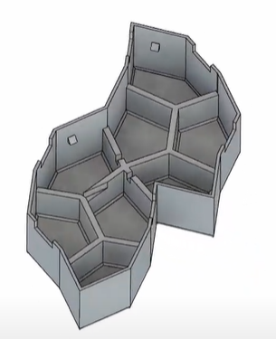

# Lannooleaf

> VIVES Project Week 2022

## Project overview

<!-- bijwerken -->

* Connectable 3D-printed leaves
* PCB-design with LEDs & communications
* Use an OTS or own communication protocol
* Webpage
* Control of leds

## [Hardware](./hardware)

### [Shape](./hardware/shape/)

Dit is onze shape. Een primitive unit met 8 leafs.

### [PCB](./hardware/pcb/)

<!-- afbeelding hardware -->

Iedere PCB bevat elk 16 RGB LED's en beschikken ieder over een eigen Raspberry Pi Pico en spanningsomzetter. De volledige documentatie over de hardware kan men [hier](./hardware/pcb/README.md) terugvinden.

## [Firmware](./firmware)

<!-- Joey, afbeelding Pico? -->

<!-- aanvullen -->

De firmware documentatie wordt automatisch gegenereed tijdens het build procces van de firmware. Deze is te vinden in de [firmware](./firmware/) folder waar het build procces word uitgelegd.

## [Software](./software/)

The [API](./software/api) connect with the SPI interface and communicates with the frontend, artnet and has a socket to run python processed gifs.

The [ArtNet](./software/artnet) api reicieves artnet broadcast messages ans sends them trough the websochet of the api to controll all the leds. The api mapps them depending on the coords.

The [Frontend](./software/frontend) from Jay is the webinterface and all of its files.

## Credits

### Team Members

* [Arno Schoutteten](https://github.com/madness007)
* [Jens Vanhove](https://github.com/JensVA)
* [Joey De Smet](https://github.com/JoeyDeSmet)
* [Jay D'Hulster](https://github.com/JayDHulster)

### Mentors

* [Nico De Witte](https://github.com/BioBoost)
* [Piet Cordemans](https://github.com/pcordemans)
* [Sille Van Landschoot](https://github.com/sillevl)
* [Jonas Lannoo](https://github.com/JonasLannoo)
