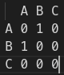

# Compiling project

## Requirements
- Cmake (version >=3.12)
- gcc-arm-none-eabi
- build essentials
- [pico_sdk](https://github.com/raspberrypi/pico-sdk)

```bash
sudo apt install cmake gcc-arm-none-eabi libnewlib-arm-none-eabi build-essential
```

### Recomended
- CMake Tools VS Code extention 

## Build

```bash
# Initialisation
mkdir build && cd build
cmake ..

# Building
cd build
cmake --build .
```

Or use vs code plugin set compiler to arm-none-eabi, click on CMake: [Debug] and select Debug on dropdown. 
Build using Build button.


## SDK documentation

- [Pi-pico-c-sdk](https://datasheets.raspberrypi.com/pico/raspberry-pi-pico-c-sdk.pdf)
  - chapter 4.2.

# Pins to use on pico

## I²C
I2C0

- SDA pin 21
- SCL ping 22

## Select pins

- pin 24, 25, 26, 27
- Graaf tree om nodes op te slaan
  - Node list neighbors
  - Agjecentsy List
  - Agacentcy matric

  
