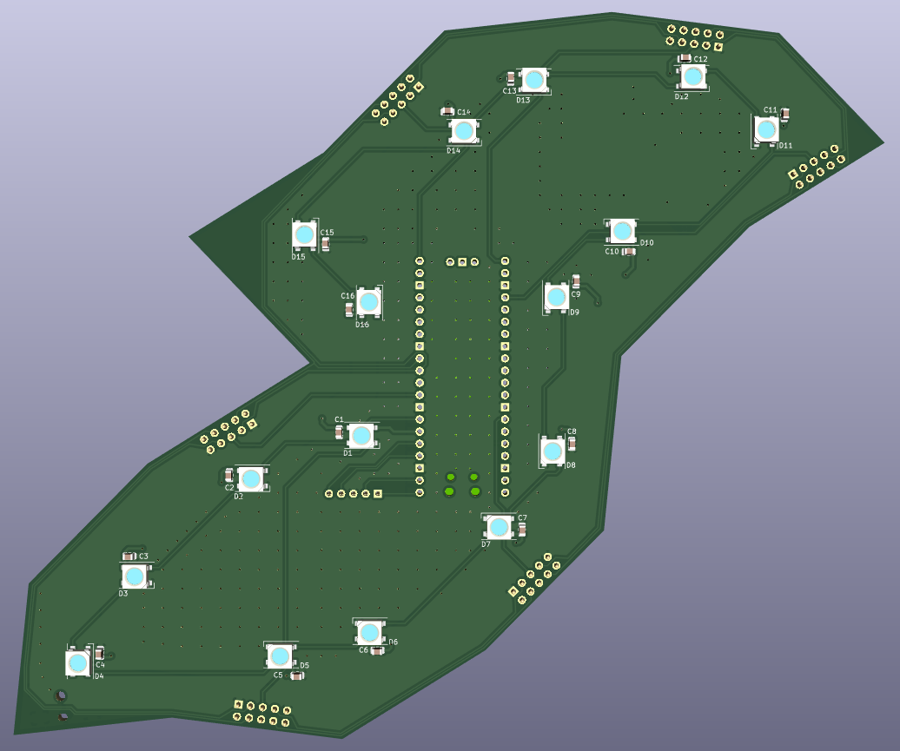
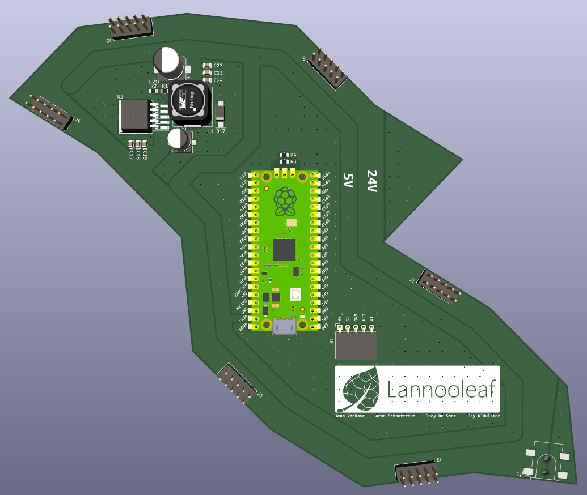
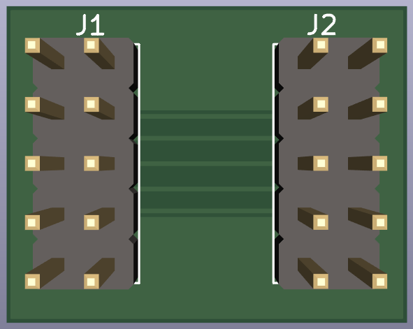
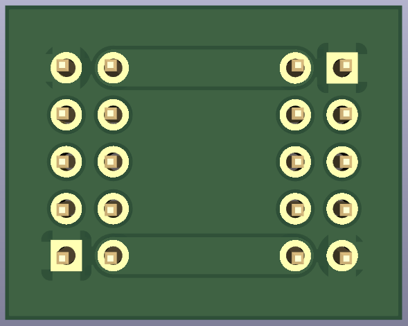

# PCB Lannooleaf

## Schematic

## PCB (leaf)

| Front | Back |
|---|---|
|  |  |

## PCB (verbindingsstuk)

| Front | Back |
|---|---|
|  |  |

## BOM (Bill of Materials)

| Designator | Quantity | Description | Footprint | Distributor | Ordercode | Price |
|---|---|---|---|---|---|---|
| U1 | 1 | Raspberry Pi Pico  | 2.54mm (2x20) | Farnell | [3643332](https://be.farnell.com/raspberry-pi/raspberry-pi-pico/raspberry-pi-32bit-arm-cortex/dp/3643332) | 3,27 € (1+) |
| | 2 | Headers pico  | 2.54mm (1x20) | TME | [ZL201-20G](https://www.tme.eu/be/nl/details/zl201-20g/lijsten-en-pin-achtige-stopcontacten/connfly/ds1021-1-20sf11/) | 0,17267  € (10+) |
| U2 | 1 | LM2575-05 (ADJ) | TO-263-5 | Farnell | [2534162](https://be.farnell.com/on-semiconductor/lm2596dsadjg/dc-dc-conv-buck-3a-150khz-to-263/dp/2534162) | 2,65 € (10+) |
| D1 - D16 | 16 | WS2812B addressable LEDS | 5050 | TME | [WS2812B-V5](https://www.tme.eu/be/nl/details/ws2812b-v5/led-diodes-smd-gekleurd/worldsemi/) | 0,1490 € (50+) |
| C1 - C16, C18, C23| 18 | 100nF | 0805 | Farnell | [2320821](https://be.farnell.com/multicomp/mc0805b104k101ct/cap-0-1-f-100v-10-x7r-0805/dp/2320821) | 0,048 € (250+) |
| C17, C22 | 2 | 1nF | 0805 | Farnell | [3019871](https://be.farnell.com/yageo/cc0805krx7r9bb102/cap-1000pf-50v-10-x7r-0805/dp/3019871) | 0,077 € (10+) |
| C19, C24 | 2 | 1µF | 0805 | Farnell | [3013482](https://be.farnell.com/samsung-electro-mechanics/cl21b105kbfnnne/cap-1uf-50v-mlcc-0805/dp/3013482) | 0,052 € (5+) |
| C20 | 1 | 100µF | 6,3x7,7mm | Farnell | [2611381](https://be.farnell.com/multicomp/mcvvt035m101ea6l/cap-100-f-35v-smd/dp/2611381) | 0,156 € (1+) |
| C21 | 1 | 220µF | 8x10,5mm | Farnell | [2611361](https://be.farnell.com/multicomp/mcvvt016m221fb3l/cap-220-f-16v-smd/dp/2611361) | 0,22 € (10+) |
| D17 | 1 | SS34 | DO-214AC (SMA) | Farnell | [2101195](https://be.farnell.com/multicomp/ss34a/diode-rectifier-3a-40v-do-214ac/dp/2101195) | 0,293 € (10+) |
| L1 | 1 | 33µH | 12x12x8mm | Farnell | [2288506](https://be.farnell.com/coilcraft/mss1278-333mld/inductor-33uh-3-1a-20-pwr-9-5mhz/dp/2288506) | 1,82 € (10+) |
| R1 | 1 | 3,1k | 0805 | Farnell | [2502845](https://be.farnell.com/walsin/wf08w3091btl/res-3k09-0-1-100v-0805-thin-film/dp/2502845) | 0,112 € (10+) |
| R2 | 1 | 1k | 0805 | Farnell | [2502859](https://be.farnell.com/walsin/wf08u1001btl/res-1k-0-1-100v-0805-thin-film/dp/2502859) | 0,103 € (10+) |
| J1-J6 | 6 | Pin sockets (2x5) | 2.54mm | TME | [ZL262-10DG](https://www.tme.eu/be/nl/details/zl262-10dg/lijsten-en-pin-achtige-stopcontacten/connfly/ds1023-2-5s21/) | 0,08281 € (100+) |

Volgende items zijn enkel voor de `controller` (leaf met speciale functionaliteit):

| Designator | Quantity | Description | Footprint | Distributor | Ordercode | Price |
|---|---|---|---|---|---|---|
| J7 | 1 | Power connector | | TME | [PC-GK2.5/SMD](https://www.tme.eu/be/en/details/pc-gk2.5_smd/dc-power-connectors/ninigi/) | 0,9084 € (2+) |
| J8 | 1 | Pin headers (1x5) right angle | 2.54mm | Farnell | [2356179](https://be.farnell.com/wurth-elektronik/61300511021/header-2-54mm-pin-tht-r-a-5way/dp/2356179) | 0,315 € (10+) |

Volgend item is enkel voor de `verbindingsstukken` tussen de leafs:

| Designator | Quantity | Description | Footprint | Distributor | Ordercode | Price |
|---|---|---|---|---|---|---|
| J1, J2 | 2 | Pin headers (2x5) | 2.54mm | TME | [ZL202-10G](https://www.tme.eu/be/nl/details/zl202-10g/lijsten-en-pin-achtige-stopcontacten/connfly/ds1021-2-5sf11-b/) | 0.05254 € (50+) |

Totale prijs componenten leaf: `12,9722 €`

Totale prijs componenten controller: `14,1956 €`

Totale prijs componenten verbindingsstuk: `0,10508 €`

## BOM (Bill of Materials) AliExpress

## BOM (Bill of Materials)

| Designator | Quantity | Description | Footprint | Distributor | Link | Price |
|---|---|---|---|---|---|---|
| D1 - D16 | 16 | WS2812B addressable LEDS | 5050 | AliExpress | [link](https://nl.aliexpress.com/item/1005002653014067.html) | 0,04324 € (1000+) |

https://nl.aliexpress.com/item/1005002653014067.html

* https://nl.aliexpress.com/item/4000262366205.html?gatewayAdapt=glo2nld&spm=a2g0o.cart.0.0.5f573c00WdXbel&mp=1
    * variant: 5p
* https://www.aliexpress.com/item/4000047784474.html?spm=a2g0o.cart.0.0.5f573c00WdXbel&mp=1

* https://www.aliexpress.com/item/32964553793.html?spm=a2g0o.cart.0.0.5f573c00WdXbel&mp=1
    * variant: 1uF
    * variant: 1nF
    * variant: 100nF
* https://www.aliexpress.com/item/1005002653014067.html?spm=a2g0o.cart.0.0.5f573c00WdXbel&mp=1
    * variant: 200pcs, white pcb
* https://www.aliexpress.com/item/4000557721022.html?spm=a2g0o.cart.0.0.5f573c00WdXbel&mp=1
    * variant: LM2596S-ADJ
