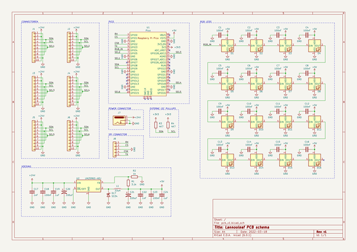

# PCB Lannooleaf

## Schematic

## PCB

| Front | Back |
|---|---|
|  |  |

## BOM (Bill of Materials)

| Designator | Quantity | Description | Footprint | Distributor | Ordercode | Price |
|---|---|---|---|---|---|---|
| U1 | 1 | Raspberry Pi Pico  | 2.54mm (2x20) | Farnell | [3643332](https://be.farnell.com/raspberry-pi/raspberry-pi-pico/raspberry-pi-32bit-arm-cortex/dp/3643332) | 3,27 € (1+) |
| U2 | 1 | TL2575-05 (ADJ) | TO-263-5 | Farnell | [2534162](https://be.farnell.com/on-semiconductor/lm2596dsadjg/dc-dc-conv-buck-3a-150khz-to-263/dp/2534162) | 2,65 € (10+) |
| D1 - D16 | 16 | WS2812B addressable LEDS | 5050 | TME | [1003273](https://www.tme.eu/be/nl/details/ws2812b-v5/led-diodes-smd-gekleurd/worldsemi/) | 0,1267 € (250+) |
| C1 - C16 | 16 | 100nF | 0805 | Farnell | [2320821](https://be.farnell.com/multicomp/mc0805b104k101ct/cap-0-1-f-100v-10-x7r-0805/dp/2320821) | 0,048 € (250+) |
| C17 | 1 | 100µF | 10x10mm | Farnell | [1834213](https://be.farnell.com/vishay/mal214097001e3/cap-100-f-35v-radial-smd/dp/1834213) | 1,65 € (10+) |
| C18 | 1 | 220µF | 10x10mm | Farnell | [2535792](https://be.farnell.com/rubycon/35trv220m10x10-5/cap-220-f-35v-smd/dp/2535792) | 0,611 € (10+) |
| D17 | 1 | 1N5819 | DO-201AD | Farnell | [3519221](https://be.farnell.com/taiwan-semiconductor/1n5822-r0g/schottky-rectifier-40v-3a-do-201ad/dp/3519221) | 0,288 € (10+) |
| L1 | 1 | 33µH | 12x12x8mm | Farnell | [2082596](https://be.farnell.com/wurth-elektronik/744770133/pd-inductor-1280-33-0uh-3-20a/dp/2082596) | 1,91 € (10+) |
| R1 | 1 | 3,1k | 0805 | Farnell | [2502845](https://be.farnell.com/walsin/wf08w3091btl/res-3k09-0-1-100v-0805-thin-film/dp/2502845) | 0,112 € (10+) |
| R2 | 1 | 1k | 0805 | Farnell | [2331796](https://be.farnell.com/te-connectivity/crgh0805j1k0/res-1k-5-0-33w-0805-thick-film/dp/2331796) | 0,007 € (10+) |
| J1-J6 | 6 | Pin headers (2x5) | 2.54mm | Farnell | [1593442](https://be.farnell.com/multicomp/2213s-10g/connector-header-tht-2-54mm-10way/dp/1593442) | 0,0718 € (50+) |

Volgende items zijn enkel voor de `controller` (leaf met speciale functionaliteit):

| Designator | Quantity | Description | Footprint | Distributor | Ordercode | Price |
|---|---|---|---|---|---|---|
| J7 | 1 | Power connector | | Farnell | [2472148](https://be.farnell.com/wurth-elektronik/694106106102/connector-power-entry-jack-5a/dp/2472148) | 1,47 € (1+) |
| J8 | 1 | Pin headers (1x5) right angle | 2.54mm | Farnell | [1593429](https://be.farnell.com/multicomp/2211r-05g/header-1-row-r-angle-5way/dp/1593429) | 0,0596 € (50+) |

Totale prijs leaf: `13,72 €`

Totale prijs controller: `15,25 €`
